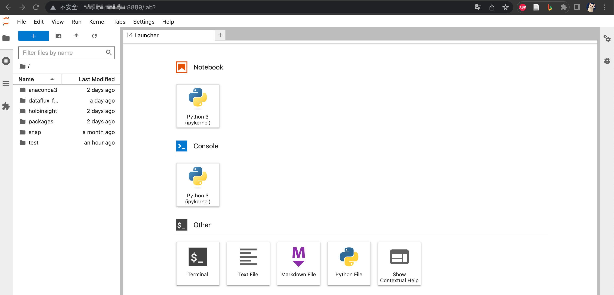

# PC 连接 Server 服务器的 Jupyter Lab 远程开发教程

注意：本教程所使用机器为MacBook Pro

## 1.安装

1. 在服务器上安装 Jupyter Lab

```shell
$ pip install jupyterlab
# 或者
$ conda install -c conda-forge jupyterlab
```


## 2.设置远程访问

1. 在服务器终端中进行以下操作：

```shell
# 进入 python3
$ python3

# 生成 hash 密码，这里输入的密码后续登陆需要
>>> from jupyter_server.auth import passwd
>>> passwd()
# 依据提示输入两遍设置的密码，从而会得到一个类似于下面的密钥
# 'sha1:5XXXXX'

# 生成配置文件
jupyter-lab --generate-config
```

2. 在 `~/.jupyter/jupyter_lab_config.py` 补充以下内容：

```python
c.ServerApp.allow_remote_access = True
c.ServerApp.ip = '*'

# 启动时不自动打开浏览器 
c.ServerApp.open_browser = False
c.LabServerApp.open_browser = False
c.ExtensionApp.open_browser = False
c.LabApp.open_browser = False

# 添加刚刚生成的密钥
c.ServerApp.password = 'sha1:5XXXXX'

# 根据个人需要修改端口号（默认 8888）
c.ServerApp.port = 8889
```


## 3.启动

1. 在服务器终端输入

```shell
$ jupyter-lab
# 常带参数
$ jupyter-lab --no-browser --port 8889 --allow-root  # 不自动打开浏览器 + 指定 8889 端口
```

注：服务器中的 Jupyter Lab 需要常驻，可以使用 `nohup` 让其后台运行。


