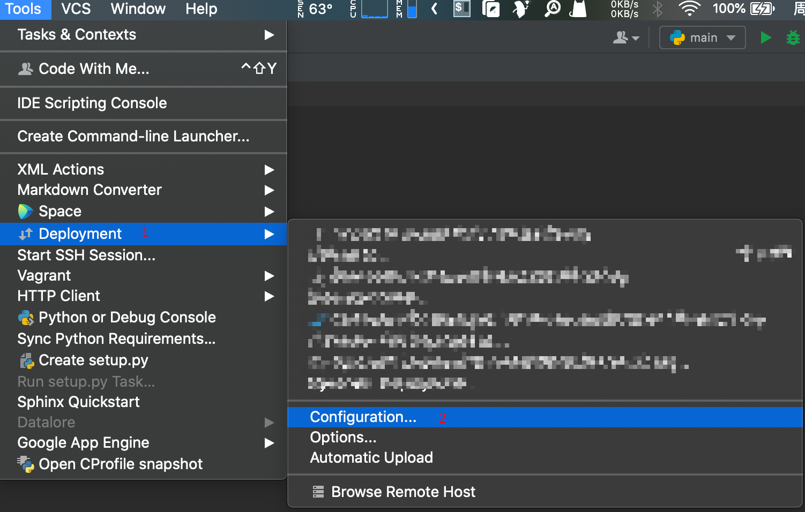
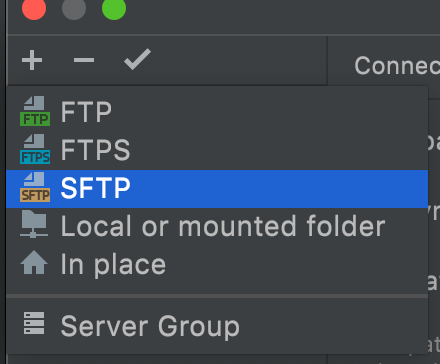
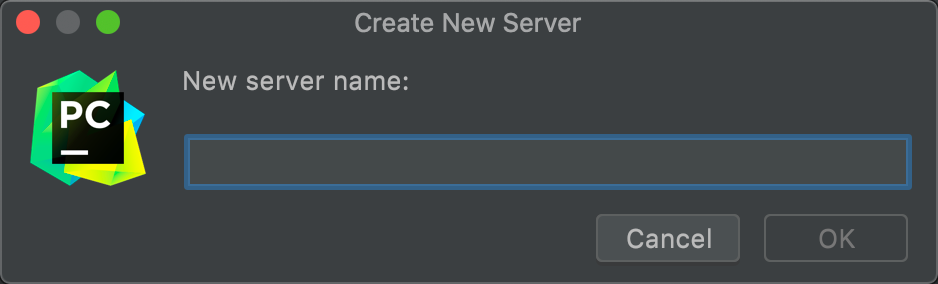
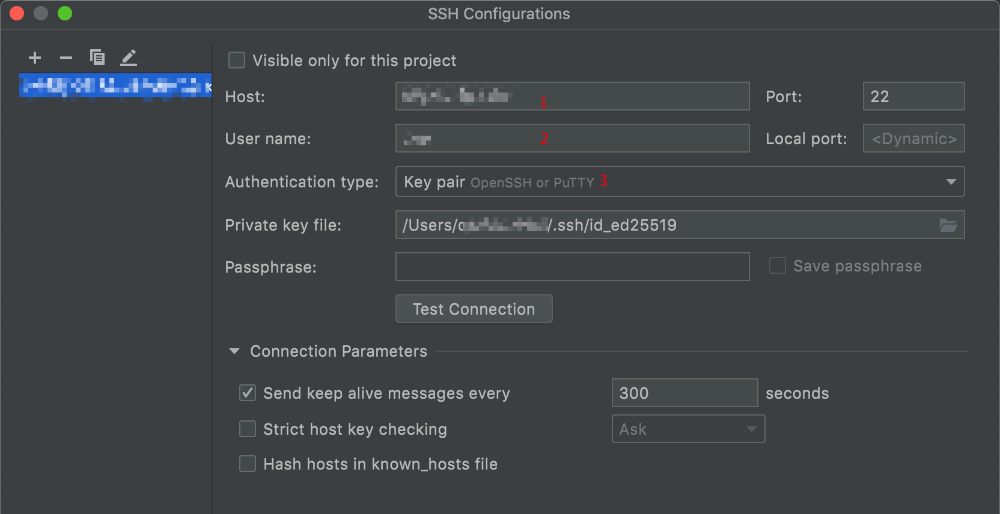
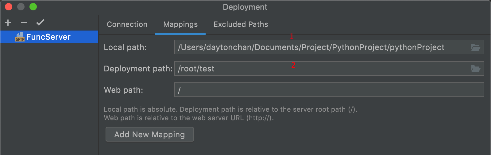
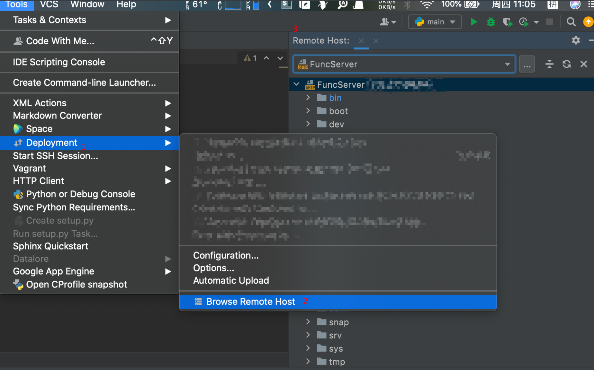
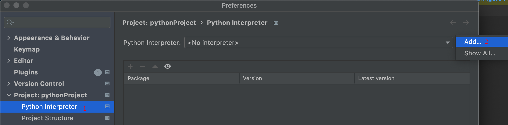
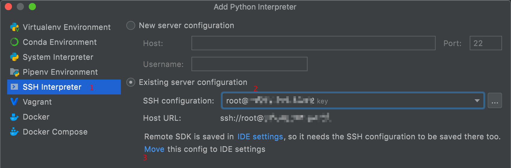
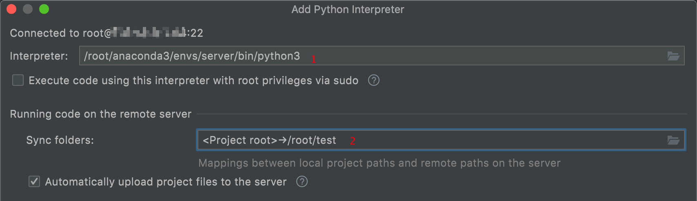
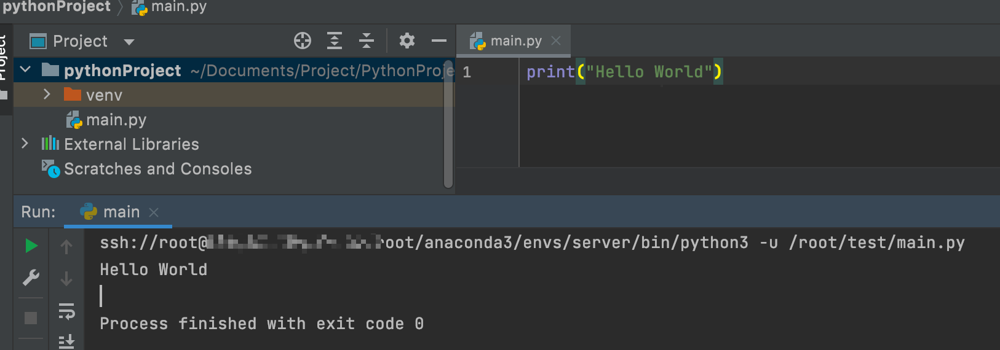

# 使用 Pycharm 连接 Server 服务器远程开发教程

## 1. 连接远程服务器

1. 依次点击 `Tools` →  `Deployment`→ `Configuration`

2. 新增一个SFTP协议的链接

3. 给链接命名

3. 配置服务器信息

选择`Connection` tab 页，输入 Host 远程服务器地址、User name 用户名、密码或者选择私钥(Key pair)进行登陆

5. 点击`Test Connection`，如果弹出连接成功，说明连接远程服务器配置成功
6. 配置同步内容

配置本地项目所在路径（图片中数字1）和远程服务器项目所在路径（图片中数字2）。这样只要某一方进行了修改，都可以手动进行代码同步

7. SSH 连接

依次点击 `Tools` → `Start SSH session`  如果`Pycharm`的 `Terminal`终端显示对应的服务器信息，说明已连接上远程服务器。

**注意：** 如果`Pycharm`的 `Terminal`终端出现中文乱码的情况，那么需要修改`Pycharm`的`Tools`配置。点击左上角 `Files` → `Settings` ，点击`Tools`，将`Default encoding`格式改为 `utf-8`

## 2. 查看远程服务器目录结构

1. 点击 `Tools`→ `Deployment`→`Browse Remote Host`

## 3. 同步代码

1. 依次点击 `Tools` → `Deployment`

   如果是想要将本地的代码同步到远程服务器，点击`Upload to XXX（XXX是远程主机的名称）`

   如果是想从远程服务器拉代码，则点击`Download from XXX（XXX是远程主机的名称）`

   如果勾选了`Automatic Upload (always)`，那么，你在本地修改了代码，Pycharm会自动将代码同步到远程服务器上（真实项目中不推荐这样，会造成代码冲突。）

## 4. 配置远程解释器进行调试

1. 点击左上角 `Files` → `Settings` (Windows) /`Pycharm` → `Preferences` (Mac)，点击`Project Interpreter`，点击`Add`

2. 选择`SSH Interpreter`，选择`Existing server configuration`，选择远程服务器

注意：这里需要 `SSH configurations` 直接点击下面的 `Move` 即可

3. 在`Interpreter` 填写远程服务器的编译位置（如果在远程服务器上还配置了虚拟环境，那么可以选定到虚拟环境所在目录下的`python3` 文件）

`Sync folders` 这里我配置了[1. 连接远程服务器](#1. 连接远程服务器)第6点的文件位置

4. 编译成功

> 注：参考博客：https://blog.csdn.net/qq_44614026/article/details/118109014
