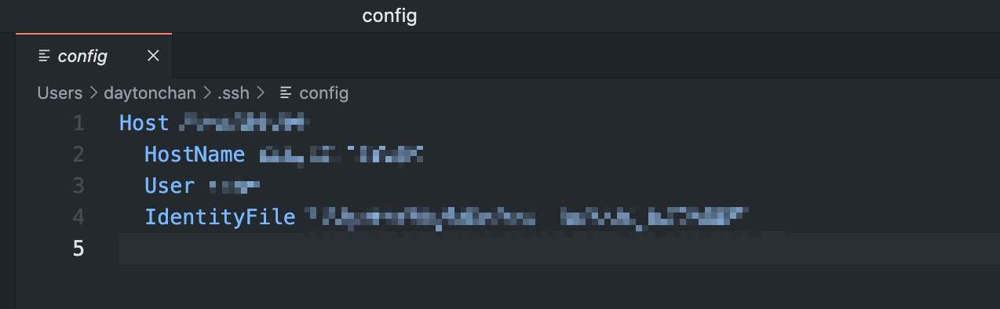

# 使用 VSCode 连接 Server 服务器远程开发教程

注意：本教程使用的本地 PC 为 MacBook Pro

## 1. 下载 VSCode

## 2. 安装 Remote SSH

1. 点开“扩展”
2. 搜索 Remote SSH
3. 安装 Remote SSH


## 3. 配置远程 SSH 所需的 Config

1. 点击远程图标
2. 点击设置
3. 选择 configuration


4. 输入 Host 为自定义给机器的名称
5. 输入 HostName 为机器的 IP 地址
6. 输入 User 为登陆机器所用的用户名
7. IdentityFile （可选）用于后续公私钥直接登陆（后续步骤），若不需要则无需填写，后续用密码登录



8. 依次选择 "文件"->"首选项"->"设置"，搜索 Show Login Terminal，勾选 ‘Always reveal the SSH login terminal’


## 4. 设置免密登陆

1. 在本地 PC生成 SSH 公钥和私钥：
``` shell
$ ssh-keygen -t rsa
```

这样会在当前目录生成名为 id_rsa 的私钥文件和名为 id_rsa.pub 的公钥文件，-t 表示密钥类型是 rsa 。

2. 进入这个目录：

 ```shell
 $ cd ~/.ssh
 ```

2. 将本地的公钥文件上传到服务器上：

``` shell
$ scp -r id_rsa.pub root[你需要登陆的用户]@XXX.XXX.XXX.XXX:/root[每个用户名称可能不同]/.ssh
```

3. 然后在服务器需要免密登录的用户家目录下查看是否有 `~/.ssh/authorized_keys` 这个文件。如果没有手动创建一个:

```shell
$ touch ~/.ssh/authorized_keys
```

然后我们将公钥内容写入到 authorized_keys 文件中，因为这个文件可能已经有内容了，所以你可以使用如下方式：

```shell
$ cat -n ~/.ssh/id_rsa.pub ~/.ssh/authorized_keys
```

4. 此时在 [配置远程 SSH 所需的 Config](#3. 配置远程 SSH 所需的 Config) 第7点中的 IdentityFile 可以填写你的私钥为 `"/Users/XXX/.ssh/id_XX"`


## 5. 连接远程机器

1. 打开远程图标
2. 选择当前窗口还是新建窗口
3. 即可连接成功


## 6.配置远程机器的 Python 编译器

1. 成功登陆远程机器后，打开扩展
2. 搜索 Python 
3. 在远程机器上安装 Python 插件


4. 安装成功后，编写代码时选择需要的编译器即可


